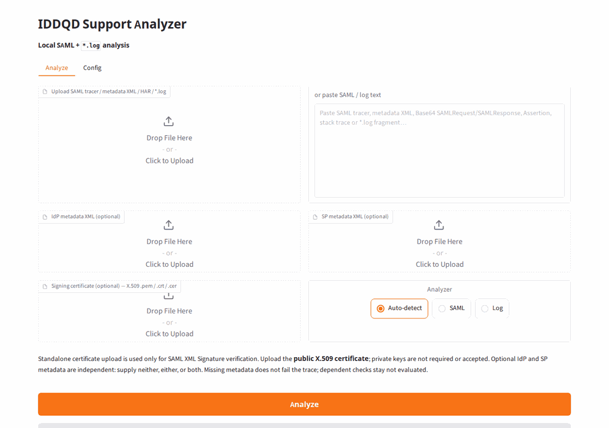
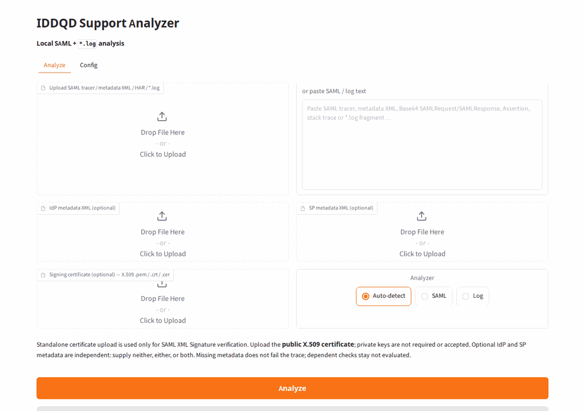

# IDDQD Support Analyzer

[](https://github.com/guayar/iddqd-support-analyzer/actions/workflows/tests.yml)

**Current version:** `0.19.3`

Local workstation tool for SAML/SSO and `*.log` troubleshooting. The **Analyze** path is deterministic and does not use an LLM. Install **full** (optional Anonymize / Assistant / General Chat) or **Light** (`IDDQD Support Analyzer Light` — Analyze + Anonymize only). Early-stage; built for my Ubuntu workstation, not a packaged product.

I own the requirements, validation rules, tests and spec interpretation; implementation is AI-assisted.

## What it does

- **Analyze** — SAML decoding (POST/Redirect), protocol/profile checks, XML signatures, optional SP/IdP metadata comparisons, and Request/Response/Assertion correlation; Java/Maven/OpenSSH logs, Oracle alert stamps/vendor codes, and `[ts] [error]` records
- **Anonymize** — local pseudonymization of logs and SAML so a copy can be shared (not DLP; review the residual leak scan)
- **Assistant** — local Ollama only: support/tech help, screenshots + OCR, latest Analyze JSON; no web search
- **General Chat** — separate module: local by default; public web search only when the turn needs current/external info

Default tabs: Analyze + Config. Order with everything on: Analyze → Anonymize → Assistant → General Chat → Config.

| Tab | Model | Web |
|---|---|---|
| Analyze / Anonymize / Config | No | No |
| Assistant | Local Ollama | No |
| General Chat | Local Ollama | Yes (search queries) |

## Demo

Paste a log or a SAML tracer, Auto-detect, Analyze. Samples below are synthetic (`example.com` / documentation IPs).

**SAML** — AuthnRequest + Response + SP/IdP metadata with ACS, Audience and Recipient mismatches:



**OpenSSH / auth.log** — reverse-DNS warning, failed passwords, `fatal: Too many authentication failures`, brute-force roll-up:



## Start

Two install flavors, same repository:

| | **Full** (default) | **Light** |
|---|---|---|
| Product name | IDDQD Support Analyzer | IDDQD Support Analyzer Light |
| Tabs | Analyze + Config; optional Anonymize, Assistant, General Chat | Analyze + Anonymize (always) + Config note |
| LLM / Ollama / web search | Optional, from Config | Not included |
| Python extras | `requirements.txt` (`ddgs`, `pillow`, `pytesseract`, …) | `requirements-core.txt` (SAML/log/anonymize only) |

**Full**

```bash
git clone https://github.com/guayar/iddqd-support-analyzer.git
cd iddqd-support-analyzer
cp config.example.env .env
./run.sh
```

**Light** (deterministic only — no Ollama):

```bash
git clone https://github.com/guayar/iddqd-support-analyzer.git
cd iddqd-support-analyzer
cp config.example.env .env
./run-light.sh
```

A first-time `./run-light.sh` creates `.venv` from `requirements-core.txt`. If `.venv` already exists from a full install, delete it first (or the extra chat libraries stay on disk; they still are not loaded). `./run-core.sh` is the same launcher under the old name.

To pack a tree **without** `chats.py` / `llm.py` / `vision.py` / `websearch.py`:

```bash
./scripts/export-light.sh
```

That writes `dist/iddqd-support-analyzer-light-<version>.zip`. Unpack, `./run.sh` (the zip contains `LIGHT_EDITION`, so it starts as Light).

UI: `http://127.0.0.1:7860`. Desktop: `./start-analyzer.sh` (respects `IDDQD_EDITION` / `./run-light.sh`). Update a checkout: `./update.sh`.

Analyze needs Python 3.12+. Full install: `./run.sh`. Light (no LLM): `./run-light.sh`. Assistant / General Chat (full edition only) also need [Ollama](https://ollama.com) and `OLLAMA_MODEL`. OCR is optional Tesseract. Details: [docs/USER.md](docs/USER.md#requirements).

## Docs

- [User guide](docs/USER.md) — modules, prerequisites, config, limitations, tests
- [Architecture](docs/ARCHITECTURE.md)
- [Third-party test data](docs/THIRD_PARTY_TEST_DATA.md)
- [Changelog](CHANGELOG.md)
