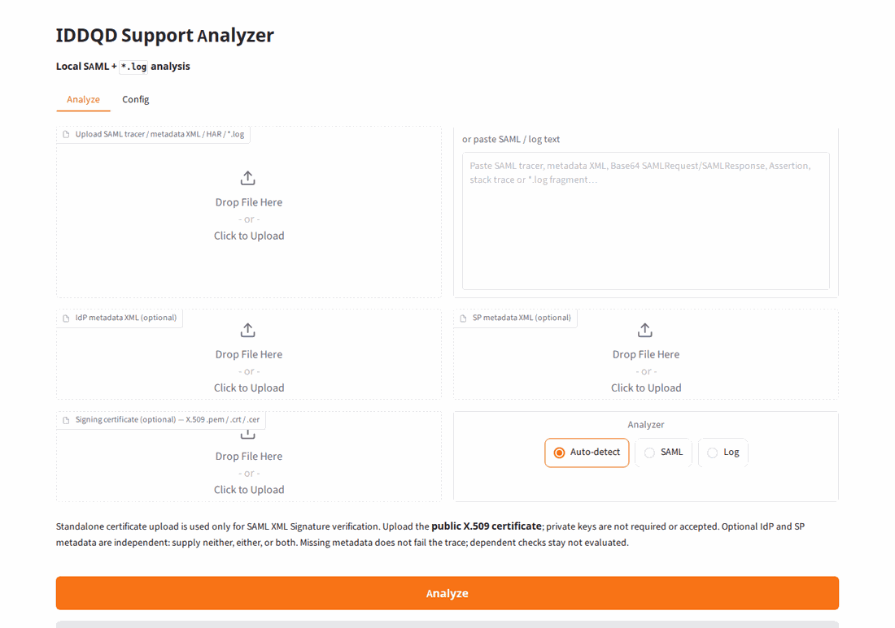
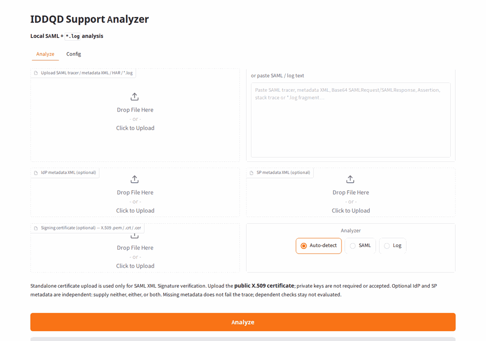

# IDDQD Support Analyzer

[](https://github.com/guayar/iddqd-support-analyzer/actions/workflows/tests.yml)

**Current version:** `0.22.0` (Early-stage, with experimental correlation features)

Local workstation tool for SAML/SSO and `*.log` troubleshooting. The **Analyze** path is deterministic and does not use an LLM. Install **full** (includes Anonymize / Knowledge Base / Assistant / General Chat) or **Light** (`IDDQD Support Analyzer Light` — Analyze + Knowledge Base + Anonymize, no LLM). Early-stage; built for my Ubuntu workstation, not a packaged product.

## Experimental Features

Starting with v0.21, IDDQD includes EXPERIMENTAL correlation and root-cause hints:
- These do NOT override deterministic Analyze findings
- These are heuristic suggestions, not proven causality
- Correlation strength / confidence scores are pattern-match indicators, NOT statistical probabilities
- Use for investigation hints only; maintain skeptical review
- See [Experimental Features](EXPERIMENTAL_FEATURES.md) for details

I own the requirements, validation rules, tests and spec interpretation; implementation is AI-assisted.

## What it does

- **Analyze** — SAML decoding (POST/Redirect), protocol/profile checks, XML signatures, optional SP/IdP metadata comparisons, and Request/Response/Assertion correlation; Java/Maven/OpenSSH logs, Oracle alert stamps/vendor codes, and `[ts] [error]` records
- **Knowledge Base** — local SQLite mini-Confluence: create/edit/delete Articles and Cases, full-text search, export/import as ZIP, link findings to troubleshooting docs; works in Light edition without LLM
- **Anonymize** — local pseudonymization of logs and SAML so a copy can be shared (not DLP; review the residual leak scan)
- **Assistant** — local Ollama only (full edition): support/tech help, KB search, screenshots + OCR, latest Analyze JSON; no web search
- **General Chat** — separate module (full edition): local by default; public web search only when the turn needs current/external info

Tab order:
- **Full**: Analyze → Knowledge Base → Anonymize → Assistant → General Chat → Config
- **Light**: Analyze → Knowledge Base → Anonymize → Config

| Tab | Full Edition | Light Edition | Requires LLM |
|---|---|---|---|
| Analyze | ✅ | ✅ | No |
| Knowledge Base | ✅ | ✅ | No |
| Anonymize | ✅ | ✅ | No |
| Assistant | ✅ | ❌ | Local Ollama |
| General Chat | ✅ | ❌ | Local Ollama |
| Config | ✅ | ✅ | No |

## Demo

Paste a log or a SAML tracer, Auto-detect, Analyze. Samples below are synthetic (`example.com` / documentation IPs).

**SAML** — AuthnRequest + Response + SP/IdP metadata with ACS, Audience and Recipient mismatches:



**OpenSSH / auth.log** — reverse-DNS warning, failed passwords, `fatal: Too many authentication failures`, brute-force roll-up:



## Start

Two install flavors, same repository:

| | **Full** (default) | **Light** |
|---|---|---|
| Product name | IDDQD Support Analyzer | IDDQD Support Analyzer Light |
| Tabs | Analyze → Knowledge Base → Anonymize → Assistant → General Chat → Config | Analyze → Knowledge Base → Anonymize → Config |
| LLM / Ollama / web search | Optional (Assistant + General Chat need Ollama) | Not included |
| Python extras | `requirements.txt` (`ddgs`, `pillow`, `pytesseract`, ollama, …) | `requirements-core.txt` (SAML/log/KB/anonymize only) |
| Knowledge Base | ✅ (with Assistant access) | ✅ (read/write/search/export/import) |

**Full**

```bash
git clone https://github.com/guayar/iddqd-support-analyzer.git
cd iddqd-support-analyzer
cp config.example.env .env
./run.sh
```

**Light** (deterministic only — no Ollama):

```bash
git clone https://github.com/guayar/iddqd-support-analyzer.git
cd iddqd-support-analyzer
cp config.example.env .env
./run-light.sh
```

A first-time `./run-light.sh` creates `.venv` from `requirements-core.txt`. If `.venv` already exists from a full install, delete it first (or the extra chat libraries stay on disk; they still are not loaded). `./run-core.sh` is the same launcher under the old name.

To pack a tree **without** `chats.py` / `llm.py` / `vision.py` / `websearch.py`:

```bash
./scripts/export-light.sh
```

That writes `dist/iddqd-support-analyzer-light-<version>.zip`. Unpack, `./run.sh` (the zip contains `LIGHT_EDITION`, so it starts as Light).

UI: `http://127.0.0.1:7860`. Desktop: `./start-analyzer.sh` (respects `IDDQD_EDITION` / `./run-light.sh`). Update a checkout: `./update.sh`.

Analyze needs Python 3.12+. Full install: `./run.sh`. Light (no LLM): `./run-light.sh`. Assistant / General Chat (full edition only) also need [Ollama](https://ollama.com) and `OLLAMA_MODEL`. OCR is optional Tesseract. Details: [docs/USER.md](docs/USER.md#requirements).

## Docker (Light Edition)

Run **Light Edition** in a container on Windows, Mac, or Linux without installing Python:

```bash
git clone https://github.com/guayar/iddqd-support-analyzer.git
cd iddqd-support-analyzer
git checkout docker-light-edition
docker-compose up
```

Open `http://localhost:7860`.

Add log files to `./inputs/` — results appear in `./outputs/`.

For details, see [DOCKER.md](DOCKER.md).

**Note:** Every `git pull` updates Light Edition; rebuild with `docker-compose build --no-cache`.

## Docs

- [User guide](docs/USER.md) — modules, prerequisites, config, limitations, tests
- [Architecture](docs/ARCHITECTURE.md)
- [Third-party test data](docs/THIRD_PARTY_TEST_DATA.md)
- [Changelog](CHANGELOG.md)
